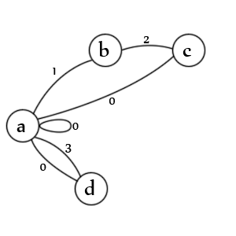

## Algorithm

Below is the algorithm used to parse a single-line of raw CSV.



*States:*

- (a) initial
- (b) delimited
- (c) capture delimited
- (d) capture undelimited

*Transitions:*

- (0) return value
- (1) opening delimiter
- (2) closing delimiter
- (3) undelimited data

*Source:*

```javascript
splitLines: function(csv, delimiter) {
  var state = 0;
  var value = "";
  var line = "";
  var lines = [];
  function endOfRow() {
    lines.push(value);
    value = "";
    state = 0;
  };
  csv.replace(/(\"|,|\n|\r|[^\",\r\n]+)/gm, function (m0){
    switch (state) {
      // the start of a value/entry
      case 0:
        if (m0 === "\"") {
          state = 1;
        } else if (m0 === "\n") {
          endOfRow();
        } else if (/^\r$/.test(m0)) {
          // carriage returns are ignored
        } else {
          value += m0;
          state = 3;
        }
        break;
      // delimited input  
      case 1:
        if (m0 === "\"") {
          state = 2;
        } else {
          value += m0;
          state = 1;
        }
        break;
      // delimiter found in delimited input
      case 2:
        // is the delimiter escaped?
        if (m0 === "\"" && value.substr(value.length - 1) === "\"") {
          value += m0;
          state = 1;
        } else if (m0 === ",") {
          value += m0;
          state = 0;
        } else if (m0 === "\n") {
          endOfRow();
        } else if (m0 === "\r") {
          // Ignore
        } else {
          throw new Error("Illegal state");
        }
        break;
      // un-delimited input
      case 3:
        if (m0 === ",") {
          value += m0;
          state = 0;
        } else if (m0 === "\"") {
          throw new Error("Unquoted delimiter found");
        } else if (m0 === "\n") {
          endOfRow();
        } else if (m0 === "\r") {
          // Ignore
        } else {
          throw new Error("Illegal data");
        }
          break;
      default:
        throw new Error("Unknown state");
    }
    return "";
  });
  if (state != 0) {
    endOfRow();
  }
  return lines;
}
```